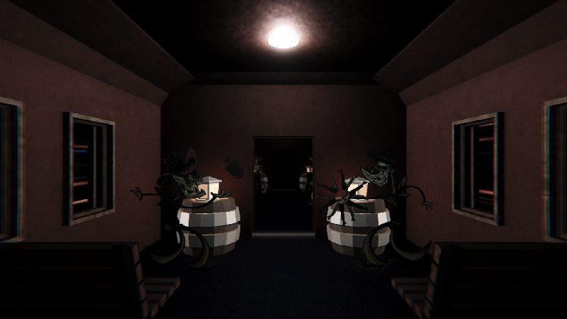

<h1 align="center">
 
Dead West
</h1>

<h3 align="center"><a href="https://drive.google.com/file/d/12Q7eucmwFIlQ50oOr9kwIXYnB8xTB5Z0/view?usp=sharing">Video</a></h3>

<h3 align="center"><a href="https://www.boisestate.edu/gimm/">GIMM</a> 200 - Visual Storytelling </h3>
<h5 align="center"><a href="https://www.boisestate.edu/">Boise State University</a> (Spring 2023) </h5>

<h4 align="center">A hybrid animation that features a mix of 3D models and 2D animations. Includes an option for gaze tracking so the user can actively look around the scene.</h4>

  <a href="#project-overview">Project Overview</a> •
  <a href="#technical-stack">Technical Stack</a> •
  <a href="#collaborators">Collaborators</a> •
  <a href="#contact">Contact</a>

## Project Overview

All aboard the interdimensional train. In this chilling hybrid animation experience, you journey through the cabins of an old-western train, witnessing ghostly passengers carrying out a variety of eerie and dangerous tasks. With built in face tracking capabilities, you can actively move the camera to look at specific areas and events along the way.

## Technical Stack

 

## Collaborators

<h3>Carson Strout:</h3>

3D Modeler • Programmer

<h3>Chase Franklin:</h3>

Artist • Animator • Programmer

## Contact

<h3>Carson Strout</h3>

 
 

 <h3>Chase Franklin</h3>

 
